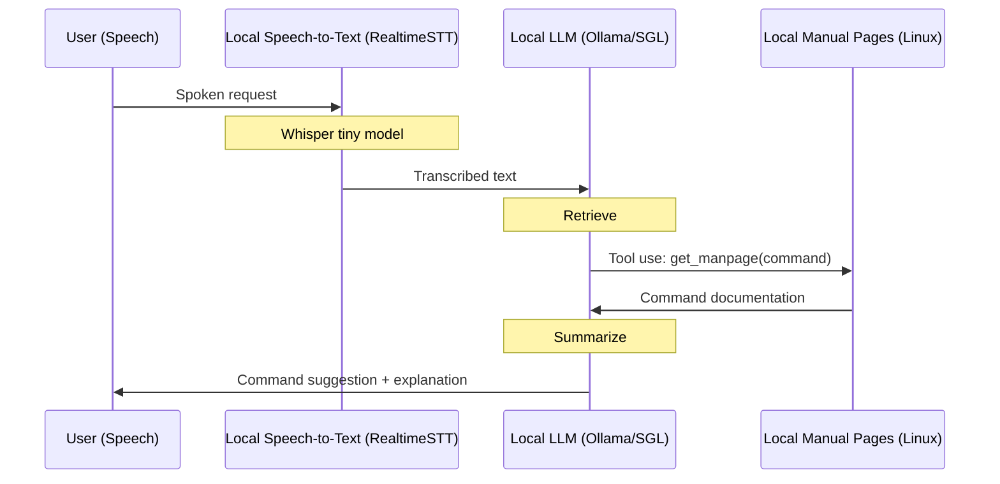

# Cerebrosonic Navigator (Example)
An example of a private speech-driven CLI assistant using local LLMs, tools/function calling, and retrieval augmented generation.


## Features
- **100% Private**: Uses on-device models via Ollama (e.g. Llama 3.2, DeepSeek-V3, DeepSeek-R1).
- **Tool-Use and RAG**: Enhanced command suggestions via real-time tool-based retrieval augmented generation. Examples using Ollama and SGLang.
- **Speech Recognition**: Real-time speech-to-text transcription for spoken navigation.
- **Simple**: Under 200 lines of code.

## On-Device Flow (Tool Use/Function Calling + RAG)


## Example Usage
```console
~$ python main.py config.yaml --input "How do I see who is logged onto the system?"
Initialized with Ollama model: llama3.2
Tasks: {'retrieve': "You are a command line (CLI) expert.  Your task is to find the command or combinations of commands that best relate to the user's input. You must be 100% sure your response does not include any arguments or parameters for the commands.\n", 'summarize': "You are a command line (CLI) expert. Explain why the command or combination of commands you found is the best match for the user's input."}
Processing text input: How do I see who is logged onto the system?
Processing input with llama3.2
HTTP Request: POST http://127.0.0.1:11434/v1/chat/completions "HTTP/1.1 200 OK"
HTTP Request: POST http://127.0.0.1:11434/v1/chat/completions "HTTP/1.1 200 OK"
Command suggestion: You can use the 'who' command to view a list of users currently logged on to the system.
Explanation: 
    The 'who' command is a built-in Linux/Unix command that displays information about the users currently logged on to the system.
    When you run the 'who' command, it shows details such as:
        * The username of each user
        * The terminal or session ID associated with each user
        * The login time for each user
    The output typically looks something like this:
        username  pts/0    2023-02-20 14:30 -  14:31 (00:01)
        username  pts/1    2023-02-20 14:32 -  14:33

~$ python main.py config.yaml --input "How do I see who is logged onto the system?" --tools
Initialized with Ollama model: llama3.2
Tasks: {'retrieve': "You are a command line (CLI) expert.  Your task is to find the command or combinations of commands that best relate to the user's input. You must be 100% sure your response does not include any arguments or parameters for the commands.\n", 'summarize': "You are a command line (CLI) expert. Explain why the command or combination of commands you found is the best match for the user's input."}
Processing text input: How do I list all open ports?
Using tool-based navigation with manpages
Querying Ollama with model: llama3.2, user_input: How do I list all open ports?
HTTP Request: POST http://127.0.0.1:11434/api/chat "HTTP/1.1 200 OK"
Retrieval Response: model='llama3.2' created_at='2025-01-31T19:15:32.095422Z' done=True done_reason='stop' total_duration=1687066291 load_duration=31716875 prompt_eval_count=223 prompt_eval_duration=1135000000 eval_count=21 eval_duration=517000000 message=Message(role='assistant', content='', images=None, tool_calls=[ToolCall(function=Function(name='get_manpage', arguments={'command': 'netstat -an'}))])
Calling get_manpage for command: netstat -an
Generating manpage summary
HTTP Request: POST http://127.0.0.1:11434/api/chat "HTTP/1.1 200 OK"
Summary Response: 
    This appears to be a output from the `netstat` command on a macOS system. It provides information about the network connections, routing table, and statistics.
    Here's a breakdown of what each section displays:
    **Network Connections**
        * `Proto Recv-Q Send-Q Local Address           Foreign Address         State`
        * `tcp        0      0 127.0.0.1:25              *.*                       LISTEN`
    This shows the number of connections and the protocols used (in this case, TCP).
    **Routing Table**
        * `Routing tables`
        * `Destination Gateway Genmask Flags Interface Local Address           Metrics`
        * `default    gateway 255.254.254.254     *                U   0      0      0`
    This displays information about the available routes and their status.
    **Statistics**
        * `Interface`
        * `Rx bytes        Tx bytes         Interrupts`
        * `eth0             1234567          9876543              12`
        * `lo               6789012          34567890             34`
    This shows statistics related to network interfaces, such as receive and transmit bytes.
    **Running Commands**
        * `-w` option is used to display running commands related to network interfaces or protocols.
        * `nstat -s -i 30` would display a summary of all interface statistics every 30 seconds.
```

## MacOS Setup Requirements
- **pyaudio**: `brew install portaudio`
- **ffmpeg**: `brew install ffmpeg`
- **python3.9** recommended

## License
Apache License 2.0. See [LICENSE](LICENSE) file for details.