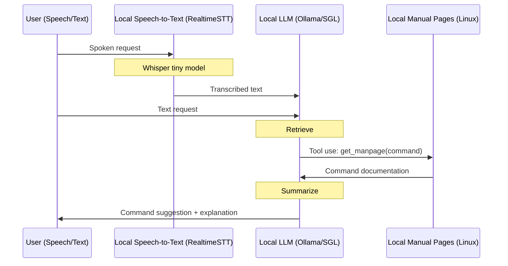

# Cerebrosonic Navigator (Example)
An example of a private speech-driven CLI assistant using local LLMs, tools/function calling, and retrieval augmented generation.


## Features
- **100% Private & Open Source**: Uses on-device models via Ollama (e.g. Llama 3.2, DeepSeek-V3, DeepSeek-R1).
- **Tool-Use and RAG**: Enhanced command suggestions via real-time tool-based retrieval augmented generation. Examples using Ollama and SGLang.
- **Speech Recognition**: Real-time speech-to-text transcription for spoken navigation.
- **Simplicity**: Under 200 lines of code.

## On-Device Flow (Tool Use/Function Calling + RAG)


## Example Usage

### Standard Navigation
```bash
$ python main.py config.yaml --input "How do I list all open ports?"
```

<details>
<summary>View output</summary>

```
INFO - Initialized with Ollama model: llama3.2
INFO - Processing text input: How do I list all open ports?
INFO - Using standard navigation
INFO - Processing input with llama3.2

Command suggestion: The netstat command

Explanation: 
**The `netstat` Command**

Command Purpose:
The `netstat` command displays active Internet connections, routing tables, and interface statistics.

Key Features:
* Displays information about active network connections
* Shows listening ports and their corresponding processes
* Provides information on routing tables and interface statistics

Common Use Cases:
* Identifying open ports and the processes using them
* Troubleshooting network connectivity issues
* Monitoring system performance and resource utilization

Related Commands:
The `ss` command is an alternative to `netstat`, offering similar functionality with more detailed information.
```
</details>

### Tool-based Navigation with Manual Pages
```bash
$ python main.py config.yaml --input "How do I list all open ports?" --tools
```

<details>
<summary>View output</summary>

```
INFO - Initialized with Ollama model: llama3.2
INFO - Processing text input: How do I list all open ports?
INFO - Using tool-based navigation with manpages
INFO - Querying Ollama with model: llama3.2
INFO - Calling get_manpage for command: netstat
INFO - Generating manpage summary

Command Overview:
The `netstat` command provides information about active Internet connections, routing tables, 
interface statistics, and more.

Options Available:
* -a, --all: Display all connections
* -i, --interfaces: Display interfaces and their statistics
* -n, --numeric-ports: Show port numbers instead of hostnames
* -p, --protocol: Specify a protocol (e.g., TCP, UDP)
* -r, --routing-table: Display the routing table
* -s, --statistics: Display statistics about interfaces and protocols
```
</details>

## MacOS Setup Requirements
- **pyaudio**: `brew install portaudio`
- **ffmpeg**: `brew install ffmpeg`
- **python3.9** recommended

## License
Apache License 2.0. See [LICENSE](LICENSE) file for details.