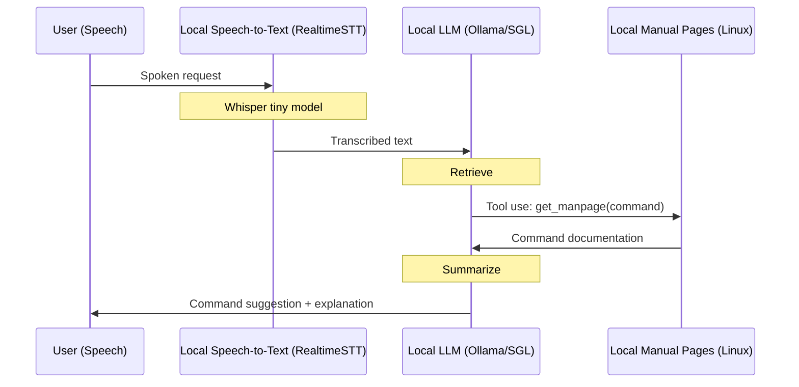

# Cerebrosonic Navigator (Example)
An example of a private speech-driven CLI assistant using local LLMs, tools/function calling, and retrieval augmented generation.


## Features
- **100% Private**: Uses on-device models via Ollama (e.g. Llama 3.2, DeepSeek-V3, DeepSeek-R1).
- **Speech Recognition**: Real-time speech-to-text transcription for spoken navigation.
- **Tool-Use and RAG**: Enhanced command suggestions via real-time tool-based retrieval augmented generation. Examples using Ollama and SGLang.
- **Simple**: Under 200 lines of code.

## On-Device Flow (Tool Use/Function Calling + RAG)


## Example Usage
```sh
(.venv) ➜  cerebrosonic-navigator git:(main) ✗ python main.py config.yaml --input "How do I see who is logged onto the system?"
2025-01-31 08:06:58.685 - INFO - Initializing with config: config.yaml
2025-01-31 08:06:58.687 - INFO - Processing text input: How do I see who is logged onto the system?
2025-01-31 08:06:58.687 - INFO - Processing input with llama3.2
2025-01-31 08:07:00.270 - INFO - HTTP Request: POST http://127.0.0.1:11434/v1/chat/completions "HTTP/1.1 200 OK"
2025-01-31 08:07:03.691 - INFO - HTTP Request: POST http://127.0.0.1:11434/v1/chat/completions "HTTP/1.1 200 OK"
2025-01-31 08:07:03.692 - INFO - Command suggestion: You can use the 'who' command to view a list of users currently logged on to the system.
2025-01-31 08:07:03.692 - INFO - Explanation: The 'who' command is a built-in Linux/Unix command that displays information about the users currently logged on to the system.

When you run the 'who' command, it shows details such as:

* The username of each user
* The terminal or session ID associated with each user
* The login time for each user

The output typically looks something like this:

username  pts/0    2023-02-20 14:30 -  14:31 (00:01)
username  pts/1    2023-02-20 14:32 -  14:33


(.venv) ➜  cerebrosonic-navigator git:(main) ✗ python main.py config.yaml --input "How do I see who is logged onto the system?" --tools
2025-01-31 08:20:40.475 - INFO - Initializing with config: config.yaml
2025-01-31 08:20:40.477 - INFO - Processing text input: How do I see who is logged onto the system?
2025-01-31 08:20:40.477 - INFO - Using tool-based navigation with manpages
2025-01-31 08:20:40.477 - INFO - Querying Ollama with model: llama3.2, user_input: How do I see who is logged onto the system?
2025-01-31 08:20:40.477 - INFO - Config OODA Loop Observe Content: You are a command line (CLI) expert.  Your task is to find the command or combinations of commands that best match the user's input. You must be 100% sure your response does not include any arguments or parameters for the commands.

2025-01-31 08:20:41.844 - INFO - HTTP Request: POST http://127.0.0.1:11434/api/chat "HTTP/1.1 200 OK"
2025-01-31 08:20:41.846 - INFO - Observe Response: model='llama3.2' created_at='2025-01-31T15:20:41.839241Z' done=True done_reason='stop' total_duration=1358939708 load_duration=32557583 prompt_eval_count=225 prompt_eval_duration=879000000 eval_count=18 eval_duration=444000000 message=Message(role='assistant', content='', images=None, tool_calls=[ToolCall(function=Function(name='get_manpage', arguments={'command': 'who'}))])
2025-01-31 08:20:41.846 - INFO - Calling get_manpage with command: who
2025-01-31 08:20:42.208 - INFO - Generating manpage summary
2025-01-31 08:20:59.115 - INFO - HTTP Request: POST http://127.0.0.1:11434/api/chat "HTTP/1.1 200 OK"
2025-01-31 08:20:59.119 - INFO - Summary Response: model='llama3.2' created_at='2025-01-31T15:20:59.109496Z' done=True done_reason='stop' total_duration=16899913708 load_duration=30214291 prompt_eval_count=2046 prompt_eval_duration=5213000000 eval_count=367 eval_duration=11651000000 message=Message(role='assistant', content='json\n{\n    "usage": "Show the login information of users currently logged on.",\n    "syntax": "who [options]",\n    "options": [\n        "-a", "--all",\n        "-A", "--all-users",\n        "-H", "--headers",\n        "-q", "--quiet",\n        "-s", "--sort",\n        "-t", "--tty"\n    ],\n    "description": "Show the login information of users currently logged on.",\n    "optionsDescription": [\n        "-a, --all",      "Show all login information including special characters."\n                            " The _u_ name may be empty or one of the special characters \'|\', \'}\', and \'~\'.",\n        "-A, --all-users", "Show all user names for whom entries are returned."\n                            " The _U_ name field is empty if no user name is available.",\n        "-H, --headers",   "Print headers with each line of output."\n                            " The column order is: NAME  S LINE         TIME         IDLE  FROM",\n        "-q, --quiet",     "Suppress the output of the header line."\n                            " The output will be in the format that is generated by _getutxent(3)_.",\n        "-s, --sort",      "Sort the user list alphabetically"\n                            " (default).  Or with -t to sort by tty name",\n        "-t, --tty"        "Sort the output by tty line number."\n                            " The default is to sort alphabetically by _u_ name."\n    ],\n    "examples": [\n        "$ who", \n        "$ who -q", \n        "$ who -s", \n        "$ who -a", \n        "$ who -H", \n        "$ who -A"\n    ]\n}\n```', images=None, tool_calls=None)

```

## MacOS Setup Requirements
- **pyaudio**: `brew install portaudio`
- **ffmpeg**: `brew install ffmpeg`
- Python 3.9 recommended

## License
Apache License 2.0. See [LICENSE](LICENSE) file for details.