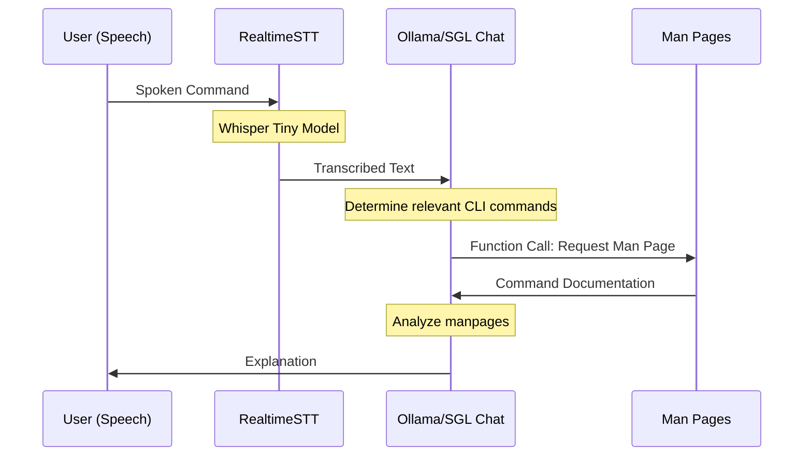

# Cerebrosonic Navigator Prototype
A private speech-driven CLI assistant using local LLMs.


## Features
- **100% Private**: Uses local models via Ollama (Llama 3.2, DeepSeek-V3, DeepSeek-R1)
- **Speech Recognition**: Real-time STT transcription
- **Tool-Use and RAG**: Enhanced command suggestions
- **Simple**: Under 200 lines of code

## Flow


## Usage
```sh
python main.py config.yaml
```

## Configuration
```yaml
apiVersion: v1
kind: Config
spec:
  models:
    ollama: llama3.2
    realtimestt: whisper-tiny
  ooda_loop:
    observe: "You are a CLI expert..."
    # Additional OODA loop configuration
```

## MacOS Setup Requirements
- **pyaudio**: `brew install portaudio`
- **ffmpeg**: `brew install ffmpeg`
- Python 3.9 recommended

## License
Apache License 2.0. See [LICENSE](LICENSE) file for details.