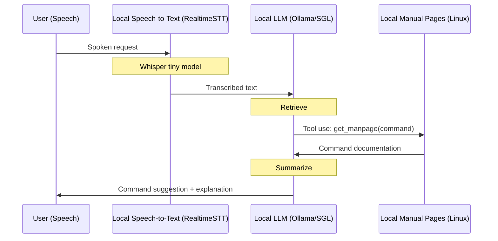

# Cerebrosonic Navigator (Example)
An example of a private speech-driven CLI assistant using local LLMs, tools/function calling, and retrieval augmented generation.


## Features
- **100% Private**: Uses on-device models via Ollama (e.g. Llama 3.2, DeepSeek-V3, DeepSeek-R1).
- **Speech Recognition**: Real-time speech-to-text transcription for spoken navigation.
- **Tool-Use and RAG**: Enhanced command suggestions via real-time tool-based retrieval augmented generation. Examples using Ollama and SGLang.
- **Simple**: Under 200 lines of code.

## On-Device Flow (Tool Use/Function Calling + RAG)


## Example Usage
```console
~$ python main.py config.yaml --input "How do I see who is logged onto the system?"
~$ python main.py config.yaml --input "How do I see who is logged onto the system?" --tools

Initializing with config: config.yaml
Processing text input: How do I see who is logged onto the system?
Processing input with llama3.2
HTTP Request: POST http://127.0.0.1:11434/v1/chat/completions "HTTP/1.1 200 OK"
HTTP Request: POST http://127.0.0.1:11434/v1/chat/completions "HTTP/1.1 200 OK"
Command suggestion: You can use the 'who' command to view a list of users currently logged on to the system.
Explanation: 
The 'who' command is a built-in Linux/Unix command that displays information about the users currently logged on to the system.
When you run the 'who' command, it shows details such as:
* The username of each user
* The terminal or session ID associated with each user
* The login time for each user
The output typically looks something like this:
username  pts/0    2023-02-20 14:30 -  14:31 (00:01)
username  pts/1    2023-02-20 14:32 -  14:33
```

## MacOS Setup Requirements
- **pyaudio**: `brew install portaudio`
- **ffmpeg**: `brew install ffmpeg`
- Python 3.9 recommended

## License
Apache License 2.0. See [LICENSE](LICENSE) file for details.